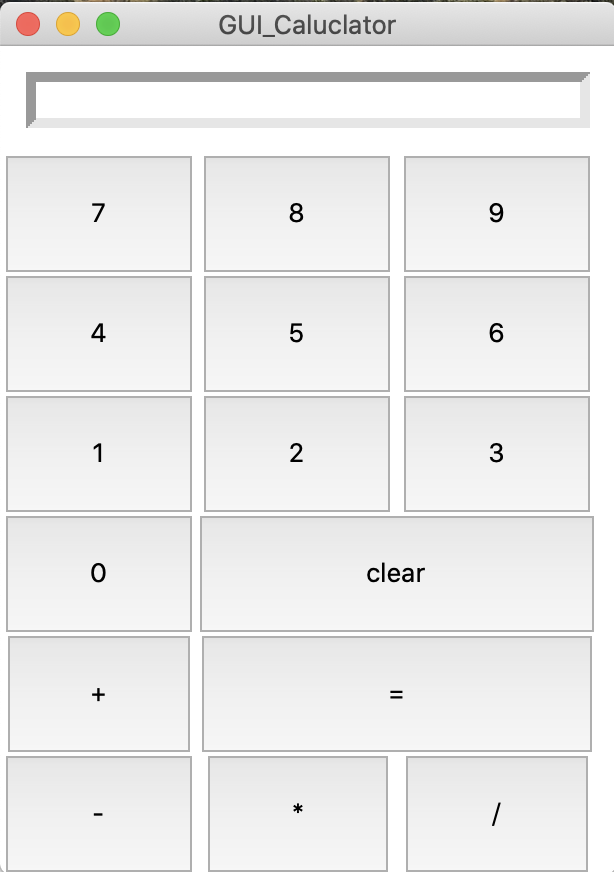

# GUI_Calculator

A very simple calculator built using Python Tkinter.

This is a simple mini-project that creates a GUI calculator using Tkinter. The purpose of this project was to refresh my memory on the tkinter and GUI lessons from the beginning of my coding career. 

If you would like to use this applicaiton, you may copy and paste the code into an IDE and save it as a python file. Then run the file via terminal / command line. The outcome should look similar to the below picture. Enjoy!

----------------------------------------------------------------------------------------------------

